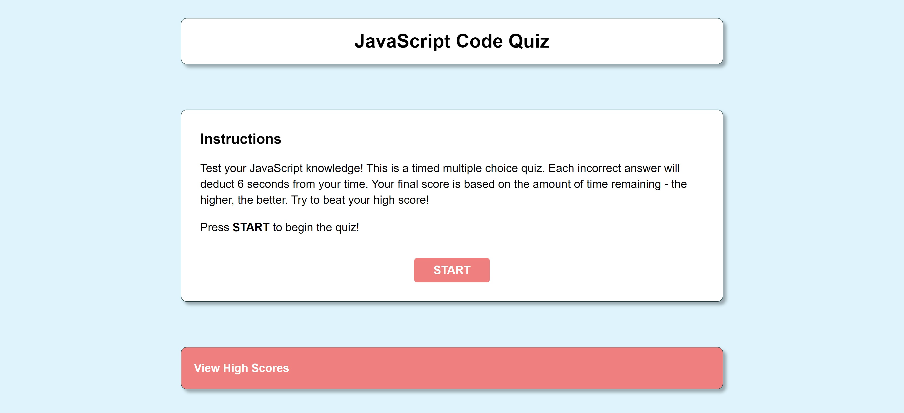

# Code Quiz for JavaScript Students

## Overview
The purpose of this project is to create an interactive multiple choice JavaScript quiz - demonstrating an understanding of basic DOM manipulation using Vanilla JavaScript.

## Contents
1. [Features](#features)
2. [Webpage](#webpage)
3. [Contribution](#contribution)

## Features
* Intro screen provides user with directions for taking the JS code quiz.
* When user clicks 'START' button, countdown timer commences.
* Timer mechanism used for score calculation - the more time left on the clock at the end of the quiz, the higher your final score will be.
* When user answers a question incorrectly, 6 seconds are deducted from the player's remaining time.
* User is alerted whether their answer was right or wrong.
* User scores are saved to localStorage and placed in a table listing the top scores.
* User can click `Reset Game` to start the quiz over.

## Webpage

[Deployed JavaScript Code Quiz](https://dereksutton.github.io/js-code-quiz/)

## Contribution
* Project requirements provided by Georgia Tech Coding Bootcamp.
* Project deliverables created by [Derek Sutton](https://github.com/dereksutton)
